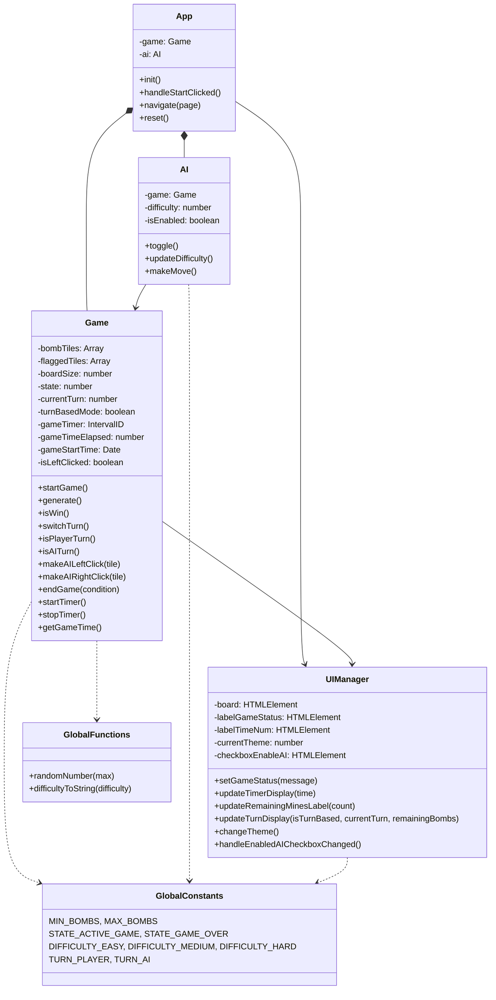

## Project Architecture UML Diagram

```mermaid
classDiagram
    class App {
        -game: Game
        -ai: AI
        +init()
        +handleStartClicked()
        +navigate(page)
        +reset()
    }
    
    class Game {
        -bombTiles: Array
        -flaggedTiles: Array
        -boardSize: number
        -state: number
        -currentTurn: number
        -turnBasedMode: boolean
        -gameTimer: IntervalID
        -gameTimeElapsed: number
        -gameStartTime: Date
        -isLeftClicked: boolean
        +startGame()
        +generate()
        +isWin()
        +switchTurn()
        +isPlayerTurn()
        +isAITurn()
        +makeAILeftClick(tile)
        +makeAIRightClick(tile)
        +endGame(condition)
        +startTimer()
        +stopTimer()
        +getGameTime()
    }
    
    class AI {
        -game: Game
        -difficulty: number
        -isEnabled: boolean
        +toggle()
        +updateDifficulty()
        +makeMove()
    }
    
    class UIManager {
        -board: HTMLElement
        -labelGameStatus: HTMLElement
        -labelTimeNum: HTMLElement
        -currentTheme: number
        -checkboxEnableAI: HTMLElement
        +setGameStatus(message)
        +updateTimerDisplay(time)
        +updateRemainingMinesLabel(count)
        +updateTurnDisplay(isTurnBased, currentTurn, remainingBombs)
        +changeTheme()
        +handleEnabledAICheckboxChanged()
    }
    
    %% Global Functions (not classes)
    class GlobalFunctions {
        +randomNumber(max)
        +difficultyToString(difficulty)
    }
    
    %% Global Constants (not classes)
    class GlobalConstants {
        MIN_BOMBS, MAX_BOMBS
        STATE_ACTIVE_GAME, STATE_GAME_OVER
        DIFFICULTY_EASY, DIFFICULTY_MEDIUM, DIFFICULTY_HARD
        TURN_PLAYER, TURN_AI
    }
    
    %% Relationships
    App *-- Game
    App *-- AI
    App --> UIManager
    Game --> UIManager
    AI --> Game
    Game ..> GlobalFunctions
    Game ..> GlobalConstants
    AI ..> GlobalConstants
    UIManager ..> GlobalConstants
```
