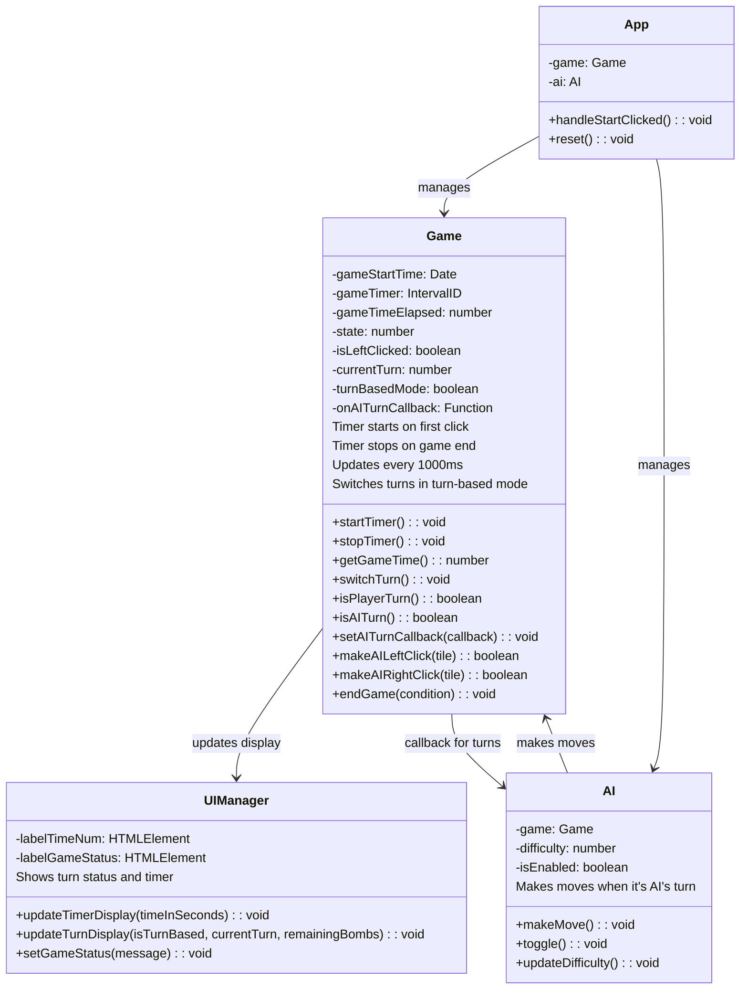

## Timer Feature UML Diagram

```mermaid
classDiagram
    class Game {
        -gameStartTime: Date
        -gameTimer: IntervalID
        -gameTimeElapsed: number
        -state: number
        -isLeftClicked: boolean
        -currentTurn: number
        -turnBasedMode: boolean
        -onAITurnCallback: Function
        
        +startTimer(): void
        +stopTimer(): void
        +getGameTime(): number
        +switchTurn(): void
        +isPlayerTurn(): boolean
        +isAITurn(): boolean
        +setAITurnCallback(callback): void
        +makeAILeftClick(tile): boolean
        +makeAIRightClick(tile): boolean
        +endGame(condition): void
    }
    
    class AI {
        -game: Game
        -difficulty: number
        -isEnabled: boolean
        
        +makeMove(): void
        +toggle(): void
        +updateDifficulty(): void
    }
    
    class UIManager {
        -labelTimeNum: HTMLElement
        -labelGameStatus: HTMLElement
        
        +updateTimerDisplay(timeInSeconds): void
        +updateTurnDisplay(isTurnBased, currentTurn, remainingBombs): void
        +setGameStatus(message): void
    }
    
    class App {
        -game: Game
        -ai: AI
        
        +handleStartClicked(): void
        +reset(): void
    }
    
    %% Relationships
    Game --> UIManager : updates display
    App --> Game : manages
    App --> AI : manages
    AI --> Game : makes moves
    Game --> AI : callback for turns
    
    %% Flow Annotations
    Game : Timer starts on first click
    Game : Timer stops on game end
    Game : Updates every 1000ms
    Game : Switches turns in turn-based mode
    AI : Makes moves when it's AI's turn
    UIManager : Shows turn status and timer
```
